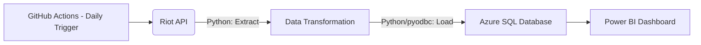

# LoL Data Pipeline

## Overview & Motivation

An end-to-end data pipeline that extracts match history and player statistics from the Riot Games API, processes the raw JSON, and loads it into a structured SQL database for analytics.

The two main motivations for this project were my passion for the game and my desire to learn how to integrate different software components to build a fully automated data pipeline—moving beyond static Excel sheets to handle dynamic, live-source data.

In this project, I used **Python** to extract, parse, and upsert data from the **Riot Games API** into an **Azure SQL Database**. For the analytics layer, I connected **Power BI** to create interactive dashboards tracking player and match telemetry.

### Data Flow Architecture



### ⚙️ Orchestration & Automation
* **Automated Scheduling**: The pipeline is fully automated using **GitHub Actions** (`.github/workflows/main.yml`).[cite: 1]
* **Execution Frequency**: Configured via a cron job to trigger a headless execution once every 24 hours, ensuring the database is continuously updated with fresh match telemetry.
* **Secrets Management**: Sensitive API keys and database connection strings are securely injected at runtime using GitHub Repository Secrets, keeping the `.env` production-safe.

## Setup

### Prerequisites

1. **ODBC Driver**: Install the Microsoft ODBC Driver for SQL Server
   - Download from: [Microsoft ODBC Driver for SQL Server](https://learn.microsoft.com/en-us/sql/connect/odbc/download-odbc-driver-for-sql-server)
   - Run the installer and install the Visual C++ Redistributable if prompted
   - Restart your terminal/VS Code after installation

2. **Environment Variables**: Create a `.env` file in the project root with:
   ```
   DB_DRIVER=ODBC Driver 17 for SQL Server
   DB_SERVER=your_server
   DB_DATABASE=your_database
   DB_USERNAME=your_username
   DB_PASSWORD=your_password
   RIOT_API_KEY=your_riot_api_key
   ```

### Installation

1. Create a virtual environment:
   ```bash
   python -m venv .venv
   ```

2. Activate the virtual environment:
   ```bash
   # Windows
   .venv\Scripts\Activate.ps1
   
   # macOS/Linux
   source .venv/bin/activate
   ```

3. Install Python dependencies:
   ```bash
   pip install -r requirements.txt
   ```

4. Initialize Database Schema

Before running the pipeline, initialize your Azure SQL Database using the provided schema script:
* Execute the SQL commands inside `Schema.sql` using **SQL Server Management Studio (SSMS)**, **Azure Data Studio**, or the **VS Code SQL Server extension** to generate the tables and relationships.

## Usage

Run the main script:
```bash
python main.py
```

## Project Structure

- `.github/workflows/main.yml` - GitHub Actions cron job configuration
- `.env.example` - Template for required environment variables
- `main.py` - Main entry point
- `riot_api.py` - Riot API integration
- `database_pipeline.py` - Database operations
- `requirements.txt` - Python dependencies
- `Schema.sql` - Database schema
- `Select.sql` - SQL queries

### Entity Relationship Diagram (ERD)

```mermaid
erDiagram
    PLAYERS ||--o{ MATCH_PARTICIPANTS : "has"
    MATCHES ||--o{ MATCH_PARTICIPANTS : "contains"
    CHAMPIONS ||--o{ MATCH_PARTICIPANTS : "played as"
    QUEUE_IDS ||--o{ MATCH_PARTICIPANTS : "classified by"
    CHAMPIONS ||--o{ CHAMPION_TAGS : "tagged as"
    ITEMS ||--o{ ITEM_TAGS : "tagged as"
    MATCH_PARTICIPANTS ||--o{ PARTICIPANT_ITEMS : "contains"
    ITEMS ||--o{ PARTICIPANT_ITEMS : "equipped in"

    PLAYERS {
        varchar puuid PK
        nvarchar gamename
        nvarchar tagline
        bit track_history
        date last_date_processed
    }

    MATCHES {
        varchar matchid PK
        bigint match_time
        float duration
        varchar queueid
        varchar gameversion
    }

    CHAMPIONS {
        int championid PK
        nvarchar champion_name
        nvarchar champion_title
    }

    CHAMPION_TAGS {
        int championid FK
        varchar champion_tag
    }

    QUEUE_IDS {
        int queueid PK
        varchar queue_name
        varchar queue_description
    }

    MATCH_PARTICIPANTS {
        varchar participantid PK
        varchar puuid FK
        varchar matchid FK
        int championid FK
        int queueid FK
        varchar participant_role
        int gold_earned
        int damage_dealt_to_champions
        int total_healing
        int kills
        int deaths
        int assists
        int vision_score
        bit win
    }

    ITEMS {
        int itemid PK
        varchar item_name
        int gold_cost
        int item_depth
    }

    ITEM_TAGS {
        int itemid FK
        varchar item_tag
    }

    PARTICIPANT_ITEMS {
        varchar participantid FK
        int itemid FK
        int item_slot
    }
